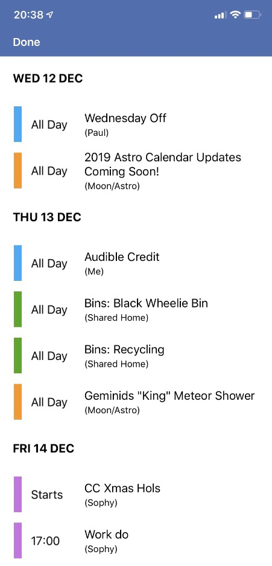

# Paul Sidnell's Scriptable Scripts

Developed on iOS with:

- [Scriptable](https://scriptable.app/)
- [WorkingCopy](https://workingcopyapp.com)

## [Calendars.js](Calendars.js)

I prefer to import Calendar events into OmniFocus as tasks and work with those since I like to add my own notes,
alarms, sub-tasks and tags for upcoming events I must prepare for. I also find going through this process a useful
part of my daily/weekly reviews.

This script facilitates that by presenting a Calendar event picker that sends selected events to OmniFocus as tasks.
There are three cases that are handled separately:

1. For simple timed events the script creates tasks that have a defer date of 00:00 on the day of the event and a due
date of the event start time.

2. For single day all day events the script creates tasks have a defer and due date of 00:00 on the day of the event.

3. For multi-day events the script creates two tasks like single day events, one for the start day and one for the finish day.

Event attendees and notes are added to the task notes.

The script can be used stand alone on an iPhone or in split view on an iPad. On an iPad it's very useful to run it
side by side with the OmniFocus app in the forecast view.

Some configuration options exist in the script itself and you will probably want to adjust some of them,
such as:

- How many days of events to display.
- Which OmniFocus projects to create tasks in, may be different for different calendars.
- Whether to ignore some calendars.
- Whether to display alternate names for some calendars.



## [Template.js](Template.js)

It's useful to be able quickly create an OmniFocus task/project from a template with variables/placeholders for dates,
times or values entered interactively as needed.

This script provides that as a Scriptable action extension. The script expects to receive a project, task or task group
shared from OmniFocus or any other application
(as [TaskPaper formatted text](https://support.omnigroup.com/omnifocus-taskpaper-reference/)).
The expanded project is then sent back to OmniFocus. I prefer to keep my templates as projects in OmniFocus itself
since the tags and formatting will always be correct.

The source template can contain variables and the script will prompt for values or provide them automatically for
special variables.

The first line (e.g. the project) must contain some special text enclosed in `<<...>>` e.g:

    My Template Project<<Target>>

Where “Target” is the name of the folder/project into which the final tasks will be placed.
Valid targets are described [here](https://inside.omnifocus.com/url-schemes), for example:

- "inbox" - place it in the inbox as a task.
- "projects" - place it in projects as a new project.
- "/task/MyProject" - place it in MyProject.
- "/folder/Myfolder" - place it in a new project in MyFolder.
- "/folder/MyFolder : SubFolder" - place it in a new project in SubFolder.

Variables/placeholders cane be placed in the template project like this:

```
some text ${NAME} some text
```

The script will pop up a dialog asking for a value for NAME when it runs.

Special variables that are filled automatically are:

- ${DATE} - 03 October 2018
- ${TIME} - 08:44
- ${DAY} - Saturday
- ${MONTH} - November
- ${YEAR} - 2018
- ${HERE} - current location, which takes a few seconds to acquire - see below.

The ${HERE} variable currently generates a maps url, ultimately I plan to use an address.

**Tips:**

- You can leave your template project paused in OmniFocus to avoid clutter, the expanded project will be active.
- Add taskpaper directives to tasks at the end of a line like @due(+1d).
- Make tags a variable with @tags(${TAG}).

Note: If the script is run directly from Scriptable (i.e. with no shared template as input) it will use a test template that puts the expanded project into the OmniFocus projects root.

An example template project (here expressed in TaskPaper syntax) is:

```
- Test Template expanded on ${DAY}<<projects>> @parallel(true) @autodone(true) @flagged
	- Task 1 uses ${VAR} and all built in variables in a note expanded at ${TIME}
		Task note demonstrating all variable types
		${VAR}
		${DATE}
		${TIME}
		${DAY}
		${MONTH}
		${YEAR}

	- Task 2 expanded at ${TIME}
```

When this is shared to Template.js, it prompts for a value for ${VAR} (where I entered "My Text") and sends the
following back to OmniFocus:

```
- Test Template expanded on Thursday @parallel(true) @autodone(true) @flagged
	- Task 1 uses My Text and all built in variables in a note expanded at 22:15
		Task note demonstrating all variable types
		My Text
		29 November 2018
		22:15
		Thursday
		November
		2018

	- Task 2 expanded at 22:15
```

Remember to share the project itself with the OmniFocus share button:


Then select Template via the Scriptable action extension:


----

Keywords: Scriptable, Calendar, TaskPaper, Template, Automation, iOS, iPhone, iPad
