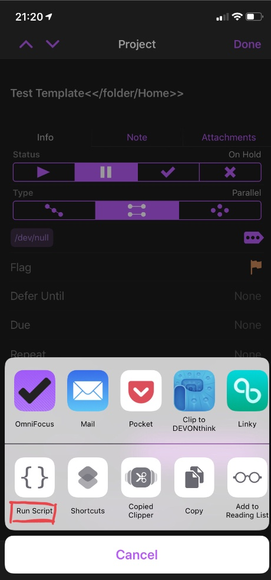

# Paul Sidnell's Scriptable Scripts

Developed on iOS with:

- [Scriptable](https://scriptable.app/)
- [WorkingCopy](https://workingcopyapp.com)

## [Calendars.js](Calendars.js)

Presents a calendar picker and creates OmniFocus tasks from selected events, preserving the start time (as the due time), notes and attendees. By default the task is deferred to 00:00 of the day of the calendar event.

The script can be used stand alone on an iPhone or in split view (for example side by side with the OmniFocus app) on an iPad.

Some configuration options exist in the script itself for:

- How many days to display.
- Specifying which OmniFocus projects to create tasks in.
- Whether to ignore some calendars.
- Whether to display alternate names for some calendars.


## [Template.js](Template.js)

This script is an action extension that expects to receive a project, task or task group shared from OmniFocus. The source can contain variables and the script will prompt for values or use built-in values.

Finally the resultant project is sent back to OmniFocus with the values expanded.

The first line (e.g. the project) must contain some special text enclosed in `<<...>>` e.g:

    My Template Project<<Target>>

Where “Target” is the name of the folder/project into which the final tasks will be placed.
Valid targets are described [here](https://inside.omnifocus.com/url-schemes), for example:
- inbox
- projects
- /task/MyProject
- /folder/Myfolder
- /folder/MyFolder : SubFolder

Variable usage in the template project is of the form:

${VARNAME}

The script will pop up a dialog asking for the value when it runs.

Special variables that are filled automatically are:

- ${DATE} - 03 October 2018
- ${TIME} - 08:44
- ${DAY} - Saturday
- ${MONTH} - November
- ${YEAR} - 2018
- ${HERE} - present location, which takes a few seconds to acquire, currently generates a maps url.

Tips:

- You can leave your template project paused in OmniFocus to avoid clutter, the expanded project will be active.
- Add taskpaper directives to tasks at the end of a line like @due(+1d).
- Make tags a variable with @tags(${TAG}).

Note: If the script is run directly from Scriptable (i.e. with no shared template as input) it will use a test template that puts the expanded project into the OmniFocus projects root.

An example template project is:

```
- Test Template expanded on ${DAY}`<<projects>>` @parallel(true) @autodone(true) @flagged
	- Task 1 uses ${VAR} and all built in variables in a note expanded at ${TIME}
		Task note demonstrating all variable types
		${VAR}
		${DATE}
		${TIME}
		${DAY}
		${MONTH}
		${YEAR}

	- Task 2 expanded at ${TIME}
```

When this is shared to Template.js, it promts for a value for ${VAR} and send the following back to OmniFocus:

```
- Test Template expanded on Thursday @parallel(true) @autodone(true) @flagged
	- Task 1 uses My Text and all built in variables in a note expanded at 22:15
		Task note demonstrating all variable types
		My Text
		29 November 2018
		22:15
		Thursday
		November
		2018

	- Task 2 expanded at 22:15
```

Remember to share the project itself to Template.js via the Scriptable action extension:

